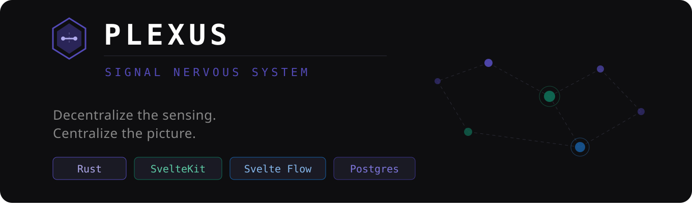
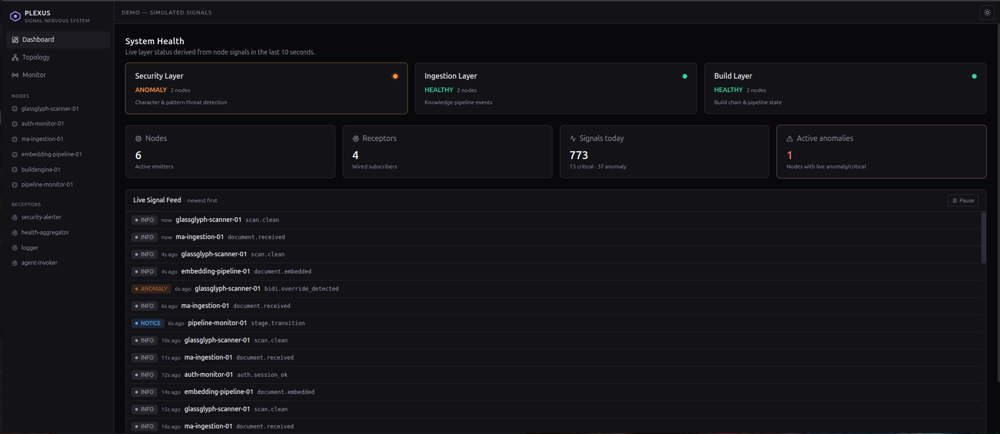
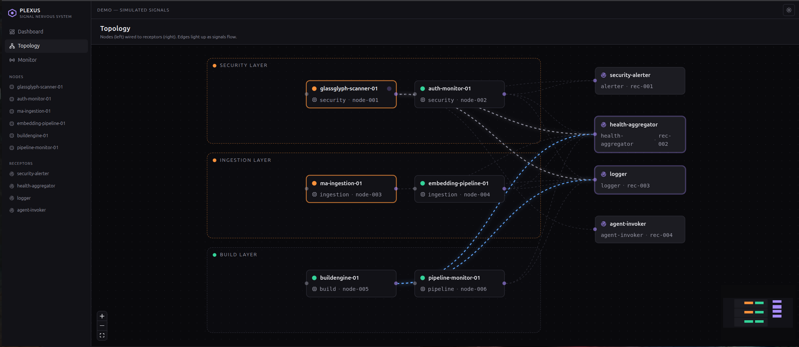

<p align="center">
  
</p>

> *Decentralize the sensing. Centralize the picture.*

Plexus is an open-source operational intelligence layer for complex systems. It
collects signals from distributed nodes, conducts them through a central stream,
and delivers them to receptors that respond in real time. It has no opinions
about what signals mean. The intelligence lives in the receptors you build on
top of it.

Plexus is the wire. The wire does not decide what travels through it.

---

## The Problem

Complex systems accumulate blind spots. Logs exist but nobody watches them in
real time. Events happen but the connections between them are invisible.
Problems compound silently until they surface as incidents.

The traditional answer is monitoring dashboards — pull data periodically,
display it, hope someone is looking when something goes wrong.

**Plexus inverts this.** Every node is a live tap on a signal-producing
component. Everything it sees it reports immediately to The Plexus. Receptors
respond in real time. The system does not wait to be checked.

---

## Core Concepts

### Nodes
A **Node** is any component that emits signals. Each node has a UUID, a type,
and a defined signal schema. Nodes do not know who is listening. They only
know how to emit.

Plexus ships with first-class node types for common use cases:

| Type | Description |
|---|---|
| `security` | Character-level and pattern-based threat detection |
| `ingestion` | Knowledge base ingestion pipeline events, document processing, embedding operations |
| `build` | Build chain execution, dependency state, artifact generation |
| `agent` | Agent task lifecycle, tool call patterns, context utilization |
| `health` | Process heartbeat, resource utilization, connectivity state |
| `pipeline` | Workflow state transitions, stage durations, stall detection |

Custom node types are supported. Define any type identifier and any payload
schema. Plexus conducts it faithfully without knowing what it means.

### Signals
A **Signal** is the atomic unit of information in Plexus. Every signal carries:

- `signal_id` — UUID, globally unique
- `node_id` — UUID of the emitting node
- `node_type` — type identifier of the emitting node
- `timestamp` — ISO 8601, set by the node at emission time
- `severity` — `info` | `notice` | `warning` | `anomaly` | `critical`
- `category` — node-defined classification string
- `payload` — structured data, node-defined schema
- `system_layer` — logical layer this node belongs to
- `sequence` — monotonically increasing integer per node

### The Plexus (Central Hub)
The Plexus is the central signal conductor. It maintains a registry of all
known nodes, accepts incoming signals, maintains a live signal stream, routes
signals to wired receptors, and tracks node liveness.

The Plexus does not evaluate signals. It does not decide which signals matter.
It routes what arrives to whoever asked to receive it.

### Receptors
A **Receptor** is a processing module that subscribes to signals from one or
more nodes and responds to them. Receptors have opinions. Plexus does not.

A receptor defines what node types it listens to, which severity levels it
cares about, and what it does when a signal arrives. A receptor can do
anything: log, alert, invoke an agent, call an API, write to a database,
chain to another receptor.

Plexus ships with first-class receptors for common use cases:

| Type | Description |
|---|---|
| `logger` | Structured log output, configurable format |
| `alerter` | Notification dispatch (webhook, messaging, email) |
| `health-aggregator` | Rolls up node signals into system-layer health status |
| `agent-invoker` | Dispatches a focused agent when signal conditions are met |
| `threshold-watcher` | Fires when a signal metric crosses a defined boundary |

### System Layers
**System layers** are logical groupings of nodes that belong together
conceptually. They exist for human comprehension — to prevent a large node
deployment from becoming visual chaos. Each layer derives a health status from
the aggregate state of its nodes:

- **Healthy** — all nodes emitting normally, no active anomalies
- **Degraded** — warning-level signals active
- **Anomaly** — anomaly-level signals active
- **Critical** — critical signals active or nodes gone silent

---

## Use Cases

### Knowledge Base Ingestion Security
Wire a character-level scanner (such as
[glassglyph-scanner](https://github.com/pringlized/glassglyph-scanner)) as a
`security` node on your knowledge base ingestion pipeline. Every document
scanned emits a signal. Clean documents emit `info`. Suspicious content emits
`warning` through `critical`. A `security-alerter` receptor notifies your team
immediately. An `agent-invoker` receptor dispatches a specialist agent to
quarantine and investigate on critical findings.

You are no longer auditing logs after the fact. You are watching the gate fire
in real time.

### Agentic Workflow Observability
In multi-agent systems, individual agents operate in isolation. Plexus gives
you a unified view across all of them. Each agent registers as a node and emits
signals on task pickup, tool calls, completion, and anomalous behavior. A
`health-aggregator` receptor maintains a live health picture. A
`threshold-watcher` receptor fires when an agent goes idle beyond a defined
threshold. You see the whole workforce at a glance.

### Build Pipeline Intelligence
Wire your build system as a `build` node. Emit signals on dependency
resolution, stage transitions, artifact generation, and failures. Plexus
accumulates the signal history. Stalls become visible before they become
incidents. Patterns emerge across builds. The `agent-invoker` receptor can
dispatch a diagnostic agent the moment anomalous build behavior is detected.

### Security Posture Monitoring
Scatter `security` nodes across your API surface, authentication layer, and
data ingestion points. Each fires signals on anomalous patterns — unusual
access, authentication failures, rate limit hits, encoding attacks. Plexus
correlates the stream across all of them. What looks like noise from a single
node resolves into a clear pattern across the whole picture.

### Any System That Produces Events
Plexus is not domain-specific and not stack-specific. If your component
produces events, it can be a node. Drop Plexus in, define your node types,
scatter your nodes, wire your receptors. The system starts watching
immediately.

---

## The Visual System

Plexus ships two visual tools as first-class features.

### Topology Editor
A canvas-based visual editor for defining and managing the entire Plexus
configuration. Nodes sit on the canvas grouped into layer regions. Receptors
appear in a sidebar panel. Connections are drawn by the user — lines from a
node to one or more receptors. A connection is a live subscription. Draw the
line, the subscription is active. Remove it, the subscription ends.

The topology configuration is JSON. The canvas is the editor for that JSON.
An LLM can generate or modify topology JSON directly — the user opens the
canvas to view and tweak the result visually.

### Live Signal Monitor
A real-time three-column view of Plexus in operation:

- **Node Broadcasts** — every signal emitted by every node, live
- **Receptor Receipts** — every signal received by every receptor, live
- **Receptor Actions** — every action taken by every receptor in response

Filterable by layer, node, and severity. The whole nervous system visible
in one view.

---

## Tech Stack

**Backend**
- Rust / Axum
- SQLx / Postgres
- WebSockets (Tokio) — live signal stream delivery
- MCP (rmcp) — receptor invocation and agent dispatch

**Frontend**
- SvelteKit
- Svelte Flow — topology canvas
- Tailwind CSS
- shadcn-svelte
- Lucide icons

---

## Running the Demo

The `ui-demo/` directory contains a fully functional SvelteKit demo with
simulated live signals. No backend required — all data is generated in the
frontend to demonstrate the full system behavior including the critical event
cascade.

```bash
cd ui-demo
npm run dev
```

The demo runs on `http://localhost:5173` by default.

The demo simulates a live six-node system across three layers (Security,
Ingestion, Build) with four receptors. Every ~90 seconds the glassglyph-scanner
node fires a critical signal and the full immune system response cascade plays
out across all pages simultaneously — security layer goes red, agent-invoker
dispatches a specialist, system resolves back to healthy.

<p align="center">
  
  <br/>
  <em>Dashboard — layer health, live signal feed, and at-a-glance stats.</em>
</p>

<p align="center">
  
  <br/>
  <em>Topology — nodes grouped by layer, wired to receptors; edges light up as signals flow.</em>
</p>

Pages included in the demo:

| Page | Route | Description |
|---|---|---|
| Dashboard | `/` | System health at a glance, live signal feed |
| Topology | `/topology` | Svelte Flow canvas with animated signal edges |
| Monitor | `/monitor` | Three-column live signal monitor |
| Node Detail | `/nodes/:id` | Per-node signal history and health |
| Receptor Detail | `/receptors/:id` | Per-receptor invocation history and configuration |

---

## Project Status

Plexus is in active R&D. The demo UI represents the target UX. The Rust backend
and WebSocket signal infrastructure are in planning. The node registration
model and topology JSON schema are the next foundational decisions before
implementation begins.

Contributions, feedback, and discussion welcome.

---

## Philosophy

Most observability platforms try to be smart. They correlate for you, they
decide what "critical" means, they ship opinions. You inherit their
assumptions, and anything that doesn't fit the platform's mental model drops
out of view.

Plexus stays deliberately dumb. The wire carries signals faithfully. What
they mean, which ones matter, and what to do about them — those decisions
live in the receptors you write, where the context is.

The restraint is the point.

---

## License

MIT. See `LICENSE`.
