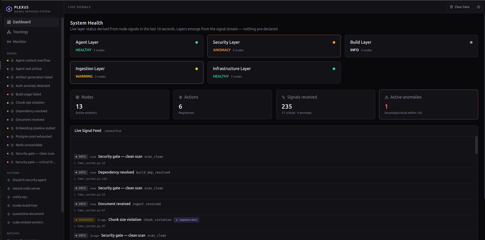
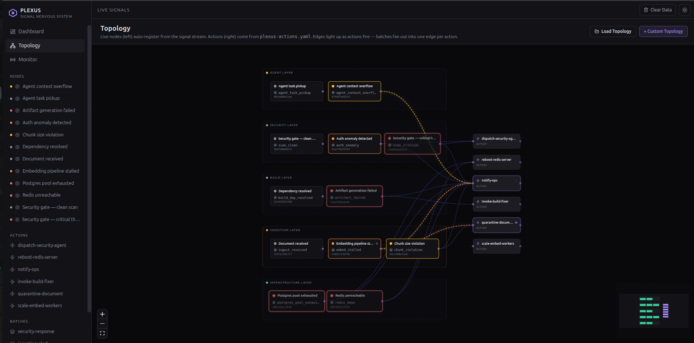

<p align="center">
  
</p>

> *Decentralize the sensing. Centralize the picture.*

Plexus is an open-source signal nervous system for live systems. Drop a
single function call anywhere in your codebase — a **pinch** — and that
moment becomes a named, typed, traceable signal that flows through a central
hub and optionally triggers a real-world action.

Plexus is the wire. The wire does not decide what travels through it.

---

## The Problem

Live data heavy systems accumulate blind spots. Logs exist but nobody watches them in
real time. Events happen but the connections between them are invisible.
Problems compound silently until they surface as incidents.

The traditional answer is monitoring dashboards — pull data periodically,
display it, hope someone is looking when something goes wrong.

**Plexus inverts this.** Every pinch is a live tap on a meaningful moment in
your code. The signal fires immediately. Actions respond in real time. The
system does not wait to be checked.

---

## How It Works

### One function call. That's the entire integration cost.

```python
from plexus import PlexusHub, Severity

hub = PlexusHub()

hub.pinch(
    payload={"doc_id": "doc-881", "threat": "homoglyph", "char": "U+0430", "scan_ms": 0.4},
    severity=Severity.CRITICAL,
    layer="security",
    name="Security scan critical",
    action="security-critical-response",
)
```

That's it. The developer drops a pinch at a meaningful point in their code
and walks away. Plexus handles everything else:

- Captures the exact **file, line, and function** where the pinch fired
- Generates a stable hash ID from the call site — no registration required
- Broadcasts the signal to the live UI
- Fires the named action or batch if one is specified
- Fires and forgets

The pinch never blocks. The pinch never waits. The pinch never cares what
happens downstream.

---

## Core Concepts

### The Pinch

```python
hub.pinch(
    payload,       # required — dict, unlimited k/v, JSON-serializable
    severity,      # required — info | notice | warning | anomaly | critical
    layer=None,    # optional — string, UI grouping
    action=None,   # optional — action or batch name
    name=None,     # optional — human label shown in the UI
)
```

**`payload`** — required. Unlimited key/value pairs. No schema. No fixed
fields. No migrations. Pass whatever is meaningful at that point in the code.

**`severity`** — required. No default. The developer must be intentional.

**`layer`** — optional. Groups this signal visually in the UI. Any string.
Layers emerge automatically from the signal stream — nothing pre-declared.

**`action`** — optional. The name of an action or batch to fire. Plexus
looks up the name — action first, batch second. No action means the signal
is a ping: flows through, updates the UI, disappears.

**`name`** — optional. Human label shown in the UI instead of the hash.

### The Ping

A pinch with no action is a ping. It flows through the hub, the UI reflects
it, and it disappears. This is the most common case. Heartbeats, clean scan
results, status updates — all pings. Presence and data. Nothing more.

### Node Identity — The Call Site Hash

Every unique pinch location has a stable identity derived automatically from
the call site:

```python
raw = f"{source_file}:{source_function}:{source_line}"
pinch_id = sha256(raw).hexdigest()[:12]  # e.g. "d2aec78bf786"
```

Same file, same function, same line — same ID. Every time. No registration.
No YAML entry. No boot sequence. The code creates the node by running.

Nodes appear in the UI automatically the first time their pinch fires.
Plexus starts with zero nodes. The system picture builds itself.

### The Signal Envelope

Every signal carries:

| Field | Source | Description |
|---|---|---|
| `pinch_id` | auto | 12-char hash of file+function+line |
| `name` | caller | optional human label |
| `layer` | caller | optional grouping string |
| `severity` | caller | info / notice / warning / anomaly / critical |
| `payload` | caller | unlimited k/v dict |
| `source_file` | auto | file where hub.pinch() was called |
| `source_line` | auto | line number |
| `source_function` | auto | function name at call site |
| `timestamp` | auto | UTC at time of pinch |
| `action` | caller | optional action or batch name |

### The Hub

`PlexusHub` is the center. It receives every pinch, builds the signal
envelope, broadcasts to the UI, and fires the action or batch if one is
defined. It has no opinions. It does not evaluate signals. It does not
decide what matters.

### Actions — The Real Adapters

An action is a Python class with one job. It receives the full signal
envelope and does its specific thing.

```python
class BaseAction:
    def __init__(self, config: dict): ...
    def execute(self, signal: Signal) -> None: ...
```

Every action gets the complete signal. What it ignores is its own business.
If a developer wires the wrong action to a signal — that is the developer's
problem. Plexus does not infer intent or validate wiring.

Actions are defined in `plexus-actions.yaml`:

```yaml
actions:
  dispatch-security-agent:
    enabled: true

  reboot-redis-server:
    enabled: true

  notify-ops:
    enabled: true

batches:
  security-response:
    - dispatch-security-agent
    - notify-ops

  infra-critical:
    - reboot-redis-server
    - notify-ops
```

**Adding a new action:** one adapter class, one registry entry, one YAML
line. Plexus core does not change.

### Batches — Fan-Out

A batch is a named collection of actions. The same complete signal is
dispatched to every action in the batch simultaneously. Same signal. Every
action. In parallel.

### System Layers

Layers are strings on the pinch. Nothing more. Type a new layer name and it
appears in the topology, the dashboard health cards, and the nav on the next
signal. No registration. No migration. No restart.

Plexus starts with zero layers. They emerge from the signal stream.

---

## Configuration

One file. That is the complete configuration surface.

**`plexus-actions.yaml`** — actions and batches. What the system can do.

No node config file. Nodes register themselves from the signal stream. Layers
emerge from the pinch. The code is the configuration.

---

## The UI

Plexus ships a SvelteKit UI that builds itself from the live signal stream
and `plexus-actions.yaml`. Nothing is hardcoded. Nothing is pre-declared.

**On load:** zero nodes, zero layers. Actions and batches load from YAML.

**As signals arrive:** nodes appear in the nav, layers materialize as health
cards, the topology canvas populates automatically — grouped by layer,
colored by severity.

### Dashboard

Layer health cards emerge from the signal stream. Stats update live — active
nodes, registered actions, total signals, active anomalies. The live signal
feed shows every pinch with name, call site, and expandable payload. Batch
tags appear inline on signals that triggered an action.

### Topology

Nodes auto-place by layer on the left. Actions appear on the right from
`plexus-actions.yaml`. Edges animate when an action fires — one edge per
action in a batch fan-out. Node health rings reflect current severity.

Saved custom views can be loaded into the same canvas read-only — stored
positions are restored, live signals continue to drive node severity and
edge animations.

### Custom Topology Views

Drag nodes and actions from the palette onto the canvas. Wiring between
a node and an action is determined by a connection map maintained
alongside the demo harness — drop a node and its wired action in any
order and the edge appears. Layout is persisted to SQLite via the
SvelteKit `/api/views` endpoints (list, create, update, delete).

### Monitor

Three columns live: node broadcasts → action receipts → action results.
Every signal row shows `filename.py:line` from the call site. Click any
row to expand the full payload.

### Node & Action Detail Pages

Per-node signal history, call site, and expandable payload on every signal.
Per-action invocation history, success rate, triggering nodes, and payload.
Per-batch execution history with full fan-out detail. All routes exist the
moment the first relevant signal arrives — no manual setup.

<p align="center">
  
  <br/>
  <em>Dashboard — five layers emerge from the signal stream. Layer health, live signal feed, and stats.</em>
</p>

<p align="center">
  
  <br/>
  <em>Topology — 13 nodes across 5 layers, auto-registered from the signal stream. 6 actions from YAML.</em>
</p>

---

## Running It

```bash
# Clone the repo
git clone https://github.com/pringlized/plexus.git
cd plexus

# Install the Python library
pip install -e .

# Terminal 1 — start the UI
cd ui-demo
npm install
npm run dev

# Terminal 2 — run the harness
cd ..
python harness/runner.py
```

The harness simulates a fictional AI platform with 13 nodes across 5 layers:
security, ingestion, build, agent, and infrastructure. Signals flow live.
Critical events trigger actions. Batch fan-outs fire simultaneously. The UI
builds the system picture in real time from zero.

---

## Use Cases

### Knowledge Base Ingestion Security

Wire a character-level scanner such as
[glassglyph-scanner](https://github.com/pringlized/glassglyph-scanner) as a
security pinch on your ingestion pipeline. Every document scanned fires a
signal. A critical finding triggers an action that dispatches a security
agent with the full payload — doc ID, threat type, character, scan duration.
The agent knows exactly what happened, exactly where in the code it happened,
and exactly what to do about it. No log archaeology. No investigation.

### Agentic Workflow Observability

In multi-agent systems, individual agents operate in isolation. Plexus gives
you a unified live picture across all of them. Each agent drops pinches on
task pickup, tool calls, completion, context overflow, and anomalous
behavior. The call site on every signal tells you not just that an agent
acted but exactly which line of code triggered it. Performance baselines,
drift detection, and cost intelligence are all derivable from the payload.

### Infrastructure Response Automation

A pinch fires when Redis becomes unreachable. The batch is `infra-critical`.
`reboot-redis-server` and `notify-ops` fire simultaneously with the full
signal payload — host, port, TCP state, consecutive failures, affected
services. The UI shows the signal, both action results, and the exact call
site. The whole incident lifecycle is visible in one place.

### Build Pipeline Intelligence

Pinch on dependency resolution, stage transitions, artifact generation, and
failures. When a build stage fails, the signal carries exit code, stage
name, error type, and duration. A batch dispatches the build fixer agent
and notifies ops simultaneously. Both actions receive the identical signal
envelope — no transformation, no filtering.

### Any System That Produces Events

If your component has a moment worth watching, drop a pinch. Name it. Layer
it. Wire an action if needed. Plexus is not domain-specific. It carries
whatever you tell it to carry.

---

## Tech Stack

**Python Library**
- Python 3.11+
- Pydantic v2 — signal envelope validation
- PyYAML — action config loading
- SQLAlchemy 2.x + Alembic — node logbook and action audit persistence
- httpx — fire-and-forget POST to UI

**UI**
- SvelteKit + Svelte 5
- Svelte Flow — topology and custom view canvas
- Tailwind CSS
- Lucide icons
- better-sqlite3 — topology view persistence

---

## Project Status

Plexus is in active development.

**Current — working**
- `PlexusHub` — signal routing, action dispatch, fire-and-forget
- `hub.pinch()` with automatic call site capture (file:line:function)
- Call site hash as stable node identity — no registration required
- Unlimited k/v payload
- Actions and batches — adapter pattern, simultaneous fan-out
- SQLAlchemy + Alembic — node logbook and action audit tables
- SvelteKit UI — zero state on load, nodes auto-register from stream
- Live signal flow: pinch → hub → HTTP POST → SSE → browser store → UI
- Node, action, and batch detail pages with live data and expandable payloads
- Custom topology views — drag, drop, auto-wire, save to SQLite, load

**Coming next**
- First live production deployment
- Node logbook TTL pruning
- Custom view management UI (rename, delete, list — endpoints exist)
- Edge color differentiation for overlapping connections

Contributions, feedback, and discussion welcome.

---

## Philosophy

Most observability platforms try to be smart. They correlate for you, decide
what critical means, ship opinions about what your system should look like.
You inherit their assumptions and anything that doesn't fit drops out of view.

Plexus stays deliberately simple. Three primitives: the pinch, the hub, the
action. The hub has no opinions. The code owns the node identity. The action
owns the response logic. The pinch owns nothing except the moment it marks.

One YAML file. An LLM can write it in two minutes. Git tracks every change.
The system picture is always honest because it has nowhere to hide.

The restraint is the point.

---

## License

MIT. See `LICENSE`.