<p align="center">
  
</p>

> *Decentralize the sensing. Centralize the picture.*

Plexus is an open-source signal nervous system for complex software. Drop a
single function call anywhere in your codebase — a **pinch** — and that
moment becomes a named, typed, traceable signal that flows through a central
hub to any number of receptors that know what to do with it.

Plexus is the wire. The wire does not decide what travels through it.

---

## The Problem

Complex systems accumulate blind spots. Logs exist but nobody watches them in
real time. Events happen but the connections between them are invisible.
Problems compound silently until they surface as incidents.

The traditional answer is monitoring dashboards — pull data periodically,
display it, hope someone is looking when something goes wrong.

**Plexus inverts this.** Every pinch is a live tap on a meaningful moment in
your code. The signal fires immediately. Receptors respond in real time. The
system does not wait to be checked.

---

## How It Works

### One function call. That's the entire integration cost.

```python
from plexus import PlexusHub, Severity

hub = PlexusHub(
    nodes_path="plexus-nodes.yaml",
    receptors_path="plexus-receptors.yaml",
)

hub.pinch("sec-gate-01", {
    "doc_id": "doc-881",
    "threat": "homoglyph",
    "char": "U+0430",
    "word": "anthropic",
    "scan_ms": 0.4,
}, severity=Severity.CRITICAL, category="scan.critical")
```

That's it. The developer drops a pinch at a meaningful point in their code
and walks away. Plexus handles everything else:

- Looks up the node definition from config
- Captures the exact **file, line, and function** where the pinch fired
- Validates the signal envelope
- Routes to every wired receptor
- Each receptor evaluates and acts — or discards to `/dev/null`
- Fires and forgets

The pinch never blocks. The pinch never waits. The pinch never cares what
happens downstream.

---

## Core Concepts

### The Pinch
A pinch is a single call to `hub.pinch()`. It marks a moment in your code
as signal-worthy. Two required arguments — a node ID and a payload dict.
Severity and category are optional.

The payload is an unlimited key/value dict. Pass whatever is meaningful at
that point in the code. Strings, numbers, bools, nested dicts, lists — any
JSON-serializable value. No schema registration. No fixed fields. No
migrations when you add new keys.

Every pinch automatically captures its **call site** — the source file, line
number, and function name where `hub.pinch()` was called. This is captured
via Python's `inspect` module and carried on every signal. No extra work from
the caller.

When a downstream agent receives a flagged signal it has everything it needs:
- **What** — node description from config
- **Where** — exact file and line in the codebase
- **What happened** — the full payload
- **How bad** — severity
- **Who flagged it** — which receptor and why

The agent doesn't investigate. It executes.

### Nodes
A **Node** is a named pinch point. It exists as four lines in
`plexus-nodes.yaml`. That's all it is.

```yaml
nodes:
  sec-gate-01:
    uuid: "a1b2c3d4-e5f6-7890-abcd-ef1234567890"
    type: security
    layer: security
    description: "Security gate on knowledge base ingestion pipeline"
```

The node ID (`sec-gate-01`) is what you pass to `hub.pinch()`. The
description is the human label. The layer is how the UI groups nodes
visually. The type is what receptors filter on.

Nodes are purely conceptual. There is no registration process. There is no
boot sequence. There is no node object in code. A node is just a name in a
config file that gives a pinch point an identity.

**First-class node types:**

| Type | Description |
|---|---|
| `security` | Character-level and pattern-based threat detection |
| `ingestion` | Knowledge base ingestion pipeline events, document processing |
| `build` | Build chain execution, dependency state, artifact generation |
| `agent` | Agent task lifecycle, tool call patterns, context utilization |
| `health` | Process heartbeat, resource utilization, connectivity state |
| `pipeline` | Workflow state transitions, stage durations, stall detection |

Custom types are supported — any string. Plexus carries it faithfully.

### Signals
A **Signal** is the envelope Plexus builds around every pinch. The caller
provides the payload. Plexus builds everything else automatically.

| Field | Source | Description |
|---|---|---|
| `signal_id` | auto | UUID, globally unique |
| `node_short_id` | caller | the node ID passed to pinch() |
| `node_uuid` | config | stable UUID from plexus-nodes.yaml |
| `node_type` | config | type string from config |
| `node_layer` | config | layer from config |
| `node_description` | config | human description from config |
| `severity` | caller | info / notice / warning / anomaly / critical |
| `category` | caller | caller-defined classification string |
| `payload` | caller | unlimited k/v dict |
| `sequence` | auto | monotonically increasing per node |
| `timestamp` | auto | UTC at time of pinch |
| `source_file` | auto | file where hub.pinch() was called |
| `source_line` | auto | line number where hub.pinch() was called |
| `source_function` | auto | function name where hub.pinch() was called |

### The Hub
`PlexusHub` is the central router. It loads config on init, builds a routing
table from `listens_to` mappings, and exposes one public method: `pinch()`.

The hub has no opinions. It does not evaluate signals. It does not decide
what matters. It routes what arrives to whoever asked to receive it.

### Receptors
A **Receptor** is where the intelligence lives. A Python class with a single
`receive(signal)` method that returns one of three decisions:

- `discard` — signal goes to `/dev/null`. Nothing written. Signal never existed.
- `flag` — signal is flagged with a human-readable reason.
- `flag+action` — flagged and an action is queued (rev2).

Receptors are defined in `plexus-receptors.yaml` and mapped to nodes via
`listens_to`. A receptor can listen to one node or fifty. A node can feed
one receptor or ten. The wiring is pure config.

```yaml
receptors:
  security-alerter:
    uuid: "r1a2b3c4-..."
    type: alerter
    description: "Flags and alerts on security anomalies and criticals"
    listens_to:
      - sec-gate-01
      - sec-auth-01
    config:
      severity_filter:
        - warning
        - anomaly
        - critical
      alert_label: "SECURITY ALERT"
```

**First-class receptor types:**

| Type | Description |
|---|---|
| `alerter` | Flags signals matching severity filter |
| `health_aggregator` | Rolls up node signals into layer health status |
| `logger` | Structured debug logging, all signals |
| `agent-invoker` | Dispatches a focused agent on match (rev2) |
| `threshold-watcher` | Fires when a metric crosses a boundary (rev2) |

**Building a custom receptor** — describe what you want to an LLM, point it
at `plexus/receptors/base.py`, and iterate. One method. No other knowledge
of Plexus internals required.

### System Layers
Layers are conceptual groupings of nodes. They exist as a string in the node
config — nothing more. Type a new layer name, refresh, and it appears in the
topology, the dashboard health cards, and the nav. No registration. No
migration. No restart.

---

## Configuration

Everything lives in two files. These files are the source of truth for the
entire system — the UI, the routing table, the topology canvas, the nav,
every detail page.

**`plexus-nodes.yaml`** — node definitions. Four fields per node.

**`plexus-receptors.yaml`** — receptor definitions and wiring.

Adding a new node: four lines of YAML. Refresh. It appears in the nav,
the topology, and as a working detail page. Zero code changes.

Adding a new layer: type a new string in the `layer` field. Refresh. Done.

Topology changes are git commits. Every wiring change is diffable,
reviewable, and reversible. `git revert` is your rollback.

---

## Use Cases

### Knowledge Base Ingestion Security
Wire a character-level scanner (such as
[glassglyph-scanner](https://github.com/pringlized/glassglyph-scanner)) as a
`security` node on your knowledge base ingestion pipeline. Every document
scanned emits a signal. Clean documents emit `info`. Suspicious content emits
`warning` through `critical`. A `security-alerter` receptor flags it
immediately with the exact file and line where the gate fired.

You are no longer auditing logs after the fact. You are watching the gate
fire in real time.

### Agentic Workflow Observability
In multi-agent systems, individual agents operate in isolation. Plexus gives
you a unified view across all of them. Each agent drops pinches on task
pickup, tool calls, completion, and anomalous behavior. The source file:line
on every signal tells you not just that an agent acted but exactly which line
of code triggered it.

### Build Pipeline Intelligence
Wire your build system as a `build` node. Pinch on dependency resolution,
stage transitions, artifact generation, and failures. When a stage fails the
flagged signal carries the exact file and function that fired — the starting
point for any automated investigation.

### Any System That Produces Events
If your component has a moment worth watching, drop a pinch. The config gives
it a name. The receptor gives it meaning.

---

## The Visual System

Plexus ships a SvelteKit UI driven entirely by the YAML config. The nav,
topology, and all detail pages build themselves from the config files. No
hardcoded UI. No admin panel. No database-backed node management.

### Topology
A Svelte Flow canvas showing nodes grouped into layer regions, wired to
receptors. Edges animate with severity-appropriate color when signals flow.

### Dashboard
Layer health cards, live signal feed, stats. All derived from the live
signal stream.

### Live Signal Monitor
Three-column real-time view: node broadcasts → receptor receipts → receptor
actions. Every signal row shows `filename.py:line` from the call site.

### Node & Receptor Detail Pages
Dynamic routes driven by config. Every node and receptor in the YAML has
a working detail page automatically.

<p align="center">
  
  <br/>
  <em>Dashboard — layer health, live signal feed, and at-a-glance stats.</em>
</p>

<p align="center">
  
  <br/>
  <em>Topology — nodes grouped by layer, wired to receptors. Edges light up as signals flow.</em>
</p>

---

## Running It

```bash
# Clone the repo
git clone https://github.com/pringlized/plexus.git
cd plexus

# Install the Python library
pip install -e .

# Terminal 1 — start the UI
cd ui-demo
npm install
npm run dev

# Terminal 2 — run the harness
cd ..
python harness/runner.py
```

The harness fires pinches across five fake system components — security
scanner, ingestion pipeline, build engine, agent worker, health monitor.
The UI receives them live and renders in real time.

Watch the topology edges light up. Watch the security layer flip to anomaly.
Watch every signal row show `fake_system.py:47`.

---

## Tech Stack

**Python Library**
- Python 3.11+
- Pydantic v2 — all models and config validation
- PyYAML — config loading
- httpx — fire-and-forget POST to UI

**UI**
- SvelteKit + Svelte 5
- Svelte Flow — topology canvas
- Tailwind CSS
- Lucide icons

---

## Project Status

Plexus rev1 is running.

**Rev1 — complete**
- `PlexusHub` with routing table and receptor evaluation
- YAML-driven config — nodes and receptors in two files
- `hub.pinch()` with automatic call site capture (file:line:function)
- Unlimited k/v payload dict
- Alerter, health-aggregator, and logger receptor types
- SvelteKit UI driven entirely by YAML config
- Live signal flow: pinch → hub → HTTP POST → SSE → browser store → UI

**Rev2 — next**
- Flagged signal persistence (SQLAlchemy + Postgres)
- Receptor actions (agent-invoker, threshold-watcher)
- Topology canvas editing — draw lines, rewrites YAML atomically
- WebSocket signal stream

Contributions, feedback, and discussion welcome.

---

## Philosophy

Most observability platforms try to be smart. They correlate for you, decide
what critical means, ship opinions about what your system should look like.
You inherit their assumptions, and anything that doesn't fit drops out of view.

Plexus stays deliberately simple. Four primitives — nodes, signals, the hub,
receptors. The hub has no opinions. The config owns the structure. The
receptors own the logic. The pinch owns nothing except the moment it marks.

Two YAML files. An LLM can write them in two minutes. Git tracks every change.
The topology is always honest because it has nowhere to hide.

The restraint is the point.

---

## License

MIT. See `LICENSE`.